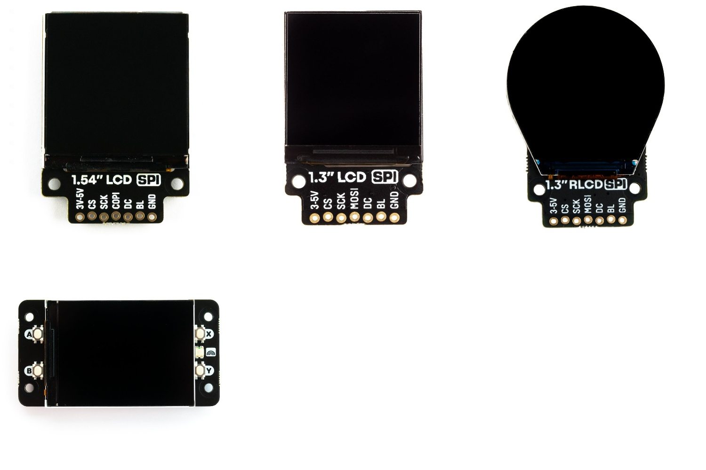

# Python ST7789

[](https://travis-ci.com/pimoroni/st7789-python)
[](https://coveralls.io/github/pimoroni/st7789-python?branch=master)
[](https://pypi.python.org/pypi/st7789)
[](https://pypi.python.org/pypi/st7789)


Python library to control ST7789 TFT LCD displays.

Designed to work with the following Pimoroni ST7789 based SPI breakouts and Raspberry Pi HATs:

- [1.54" SPI Colour Square LCD (240x240) Breakout](https://shop.pimoroni.com/products/1-54-spi-colour-square-lcd-240x240-breakout)
- [1.3" SPI Colour Square LCD (240x240) Breakout](https://shop.pimoroni.com/products/1-3-spi-colour-lcd-240x240-breakout)
- [1.3" SPI Colour Round LCD (240x240) Breakout](https://shop.pimoroni.com/products/1-3-spi-colour-round-lcd-240x240-breakout)
- [Display HAT Mini](https://shop.pimoroni.com/products/display-hat-mini) (2.0" 320x240 LCD)



# Installation

First, make sure you have the following dependencies:

````bash
sudo apt update
sudo apt install python3-rpi.gpio python3-spidev python3-pip python3-pil python3-numpy
````

Install this library by running:

````bash
sudo pip3 install st7789
````

You will also need to make sure I2C and SPI are enabled in raspi-config (`sudo raspi-config`) - you can find them under Interface Options. 

# Examples

You can find some examples of use in the examples folder. Clone this repo with:

```bash
git clone https://github.com/pimoroni/st7789-python
```

and navigate into the examples folder with:

```bash
cd ~/st7789-python/examples/
```

You can pass most of them a parameter (`square`, `rect`, `round`, or `dhmini`) to specify the size/shape/rotation of screen, like this:

```bash
python3 shapes.py dhmini
```

# Licensing & History

This library is a modification of a modification of code originally written by Tony DiCola for Adafruit Industries, and modified to work with the ST7735 by Clement Skau.

To create this ST7789 driver, it has been hard-forked from st7735-python which was originally modified by Pimoroni to include support for their 160x80 SPI LCD breakout.

## Modifications include:

* PIL/Pillow has been removed from the underlying display driver to separate concerns- you should create your own PIL image and display it using `display(image)`
* `width`, `height`, `rotation`, `invert`, `offset_left` and `offset_top` parameters can be passed into `__init__` for alternate displays
* `Adafruit_GPIO` has been replaced with `RPi.GPIO` and `spidev` to closely align with our other software (IE: Raspberry Pi only)
* Test fixtures have been added to keep this library stable

Pimoroni invests time and resources forking and modifying this open source code, please support Pimoroni and open-source software by purchasing products from us, too!

Adafruit invests time and resources providing this open source code, please support Adafruit and open-source hardware by purchasing products from Adafruit!

Modified from 'Modified from 'Adafruit Python ILI9341' written by Tony DiCola for Adafruit Industries.' written by Clement Skau.

MIT license, all text above must be included in any redistribution
